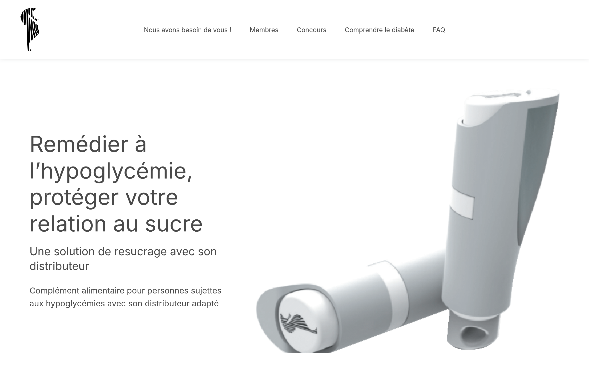

<div align="center">

# Arthur Fresse

### Software Engineer • Full Stack • AI • Automation • IoT

[](https://git.io/typing-svg)

> Building software that removes repetitive work through automation, AI and embedded systems.

</div>

---

## 👋 About Me

I'm a French **Software Engineer** passionate about designing software that automates repetitive work.

My interests span across:

- 🌐 Full Stack Development
- 🤖 Artificial Intelligence
- 📡 Embedded Systems
- ⚙️ Automation
- ☁️ Cloud & DevOps

Whether it's a web application, an AI agent, an ESP32 or a Raspberry Pi, I always ask myself one question:

> **Can this be automated?**

---

## 💻 Terminal

```console
arthur@github:~$ whoami
Arthur Fresse

arthur@github:~$ cat role.txt
Software Engineer

arthur@github:~$ cat stack.txt
Python
TypeScript
JavaScript
Next.js
React
Flutter
Node.js
Docker
Linux

arthur@github:~$ echo "If I do it twice, I automate it."
If I do it twice, I automate it.

arthur@github:~$ exit
logout
```

---

## 🚀 Featured Projects

### 💊 Hypocaps

Neutral-tasting glucose solution for people with hypoglycemia — a website to present the project and collect user feedback through a dynamic survey.

**Stack:** Next.js · React · TypeScript · Supabase



🔗 [hypocaps.fr](https://hypocaps.fr) · [Source](https://github.com/frarthur/Hypocaps_web)

### 📵 NoInsta

A lightweight Instagram wrapper focused on direct messages. No feed, no reels, just conversations.

**Stack:** Flutter · Dart

  

🔗 [Source](https://github.com/frarthur/no-insta) · [APK releases](https://github.com/frarthur/no-insta/releases)

### 🌬️ PWM Ventilo Noctua

ESP32 controller for a Noctua 4-pin fan (25 kHz PWM): manual mode via potentiometer or auto mode following the PC's CPU temperature, with an embedded web interface (live RPM, 30 min history, editable fan curve).

**Stack:** ESP32 · C++ · PlatformIO · Web UI


🔗 [Source](https://github.com/frarthur/PWM-ventilo-Noctua)

---

## 🛠️ Tech Stack

### Languages


### Frameworks


### Backend & Cloud

`Node.js` · `REST APIs` · `Supabase` · `Docker` · `GitHub Actions`

### Embedded

`ESP32` · `ESP8266` · `Raspberry Pi` · `Arduino` · `Home Assistant`

---

## 📈 GitHub Activity

<div align="center">





### 🕹️ Arcade

<picture>
  <source media="(prefers-color-scheme: dark)" srcset="https://raw.githubusercontent.com/frarthur/frarthur/pacman-output/galaga-contribution-graph-dark.svg">
  <source media="(prefers-color-scheme: light)" srcset="https://raw.githubusercontent.com/frarthur/frarthur/pacman-output/galaga-contribution-graph.svg">
  
</picture>

</div>

---

## 🏆 Achievements

<div align="center">


</div>

---

## 👀 Visitor Count

<div align="center">


</div>

---

<div align="center">

### Build once. Automate forever.

</div>
